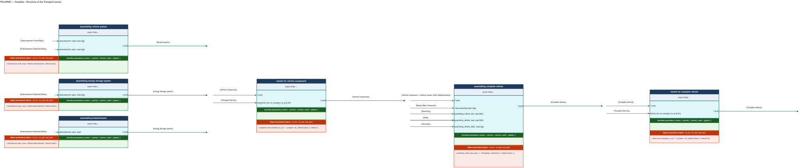

# Vehicle Manufacturing
The Vehicle Manufacturing module cover the fabrication processes of a road vehicle.
## Taxonomy and definitions
This module is built on the following object dimensions :

<table>
  <tr>
    <th>Space</th>
    <th>Dimensions</th>
    <th>Definition</th>
  </tr>

  <tr>
    <td rowspan="8">Vehicle</td>
    <td>Vehicle Class</td>
    <td>In Canada, the classification of vehicles is achieved on the basis of two quantitative criteria : the Gross Vehicle Weight Rate and the interior volume.</td>
  </tr>

  <tr>
    <td>Powertrain</td>
    <td>The power generator used in the vehicle.</td>
  </tr>

   <tr>
    <td>Vehicle ModelYear</td>
    <td>The year of the manufactured batch of the model (a same model can have slightly different properties through the years).</td>
  </tr>

   <tr>
    <td>Vehicle MakeModel</td>
    <td>The model of the vehicle.</td>
  </tr>

   <tr>
    <td>Vehicle GWVR</td>
    <td>The Gross Vehicle Weight Rating represents the maximum safe weight of a vehicle when fully loaded : it encompasses the curbmass of the vehicle and passengers and cargo weight. (This dimensions hasn't been used yet : it is yet to determine if it can be useful in the future.)</td>
  </tr>

   <tr>
    <td>Vehicle Component</td>
    <td>The main blocks on which is built the vehicle.</td>
  </tr>

   <tr>
    <td>Battery chemistry</td>
    <td>For BEVs and hybrid systems, the battery functions with a certain battery chemistry which can vary from a model to an other.</td>
  </tr>

   <tr>
    <td>Vehicle Subcomponent</td>
    <td>The most granular level of elements composing the vehicle yet : they can be seen as a recipe to build the Vehicle Component</td>
  </tr>
  </table>

This module is also built on the following action dimensions :

<table>
  <tr>
    <th>Space</th>
    <th>Dimensions</th>
    <th>Definition</th>
  </tr>

  <tr>
    <td rowspan="8">Vehicle Manufacturing</td>
    <td>Component Assembling</td>
    <td>Exclusively cover the fabrication of the Vehicle Component.</td>
  </tr>

  <tr>
    <td>Vehicle Assembling</td>
    <td>Covers the fabrication of the complete vehicle with the Vehicle Component.</td>
  </tr>

   <tr>
    <td>Marketing Component</td>
    <td>Covers the transportation of the Vehicle Component.</td>
  </tr>

   <tr>
    <td>Marketing Vehicle</td>
    <td>Covers the transportation of complete vehicle.</td>
  </tr>
  </table>

## Model and hypothesis
The complete vehicle is composed of three main Vehicle Component blocks :
- **Vehicle system**
- **Energy storage system**
- **Chassis&Body**

Those Vehicle Component are themselves composed of Vehicle Subcomponent elements. The mass of those elements is defined in one of the two following ways :
- Fixed Mass : the mass of the subcomponent takes a fixed value depending only the Vehicle Class and the Powertrain.
- Specified Mass : the mass of the component is calculated based on the mass ratio of the subcomponent to the curbmass of the vehicle (the ratio depends on the Vehicle Class and the Powertrain).

The three Vehicle Component have the following "recipes" :

**A. Vehicle system**

The recipe depends on the Powertrain.
<table>
  <tr>
    <th>Powertrain</th>
    <th>Mass Calculation</th>
    <th>Subcomponent</th>
  </tr>

  <!-- ICEV -->
  <tr>
    <td rowspan="4">ICEV (-gasoline or -diesel)</td>
    <td>Fixed Mass</td>
    <td>Gearbox</td>
  </tr>

  <tr>
    <td rowspan="3">Specified Mass</td>
    <td>Combustion engine (full unit: block, head, moving parts and engine hardware)</td>
  </tr>

  <tr>
    <td>Exhaust system (post-combustion exhaust line and aftertreatment equipment)</td>
  </tr>

  <tr>
    <td>Transmission</td>
  </tr>

  <!-- BEV -->
  <tr>
    <td rowspan="6">BEV</td>
    <td rowspan="4">Fixed Mass</td>
    <td>PDU (power distribution/protection high-voltage unit)</td>
  </tr>

  <tr>
    <td>Charger (on-board charging hardware)</td>
  </tr>

  <tr>
    <td>Converter</td>
  </tr>

  <tr>
    <td>Inverter (for motor control/regeneration)</td>
  </tr>

  <tr>
    <td rowspan="2">Specified Mass</td>
    <td>e-motor (traction electric machine)</td>
  </tr>

  <tr>
    <td>Transmission</td>
  </tr>
</table>

**B. Body&Chassis**

The recipe depends on the Vehicle Class.
<table>
  <tr>
    <th>Vehicle Class</th>
    <th>Mass Calculation</th>
    <th>Subcomponent</th>
  </tr>

  <!-- ICEV -->
  <tr>
    <td rowspan="3">Light Duty Vehicle (excl. Pickup trucks)</td>
    <td rowspan="3">Specified Mass</td>
    <td>Glider (excl. tire&wheel) (non-propulsion body&chassis package used as a proxy dataset)</td>
  </tr>

  <tr>
    <td>Tires</td>
  </tr>

  <tr>
    <td>Wheels</td>
  </tr>

  <!-- BEV -->
  <tr>
    <td rowspan="4">Pickup trucks</td>
    <td rowspan="4">Specified Mass</td>
    <td>Cabin</td>
  </tr>

  <tr>
    <td>Frame-Blanks-Saddle</td>
  </tr>

  <tr>
    <td>Suspension</td>
  </tr>

  <tr>
    <td>Tires&Wheels</td>
  </tr>
</table>

  **C. Energy storage system**

The recipe depends on the Powertrain.
The mass calculation of the elements is different from the others.
The mass of a battery is calculated based on the fraction of its Capacity (kWh)  over its Specific energy (kWh/kg). The mass of a fuel tank is a proxy based on the fuel tank capacity (L) and a reference fuel tank (for which we have data on capacity and mass) :  precise model is explained [here](https://github.com/polariis-plus/bd-conso-transport/blob/main/modules/vehicle_component/fuel_tank_proxy/fueltank_readme.md)
<table>
  <tr>
    <th>Powertrain</th>
    <th>Mass Calculation</th>
    <th>Subcomponent</th>
  </tr>

  <!-- ICEV -->
  <tr>
    <td>ICEV (-gasoline or -diesel)</td>
    <td>Mass Proxy</td>
    <td>Fuel Tank</td>
  </tr>

  <!-- BEV -->
  <tr>
    <td>BEV</td>
    <td>Specified Mass</td>
    <td>Battery</td>
  </tr>
</table>

Those recipes actually end up as Bills of Material for the fabrication of the Vehicle Component. **No other resources than the Vehicle Subcomponents are used in the model.**

**All resources necessary for the assembling of the Vehicle Components and the vehicle itself are grouped in the final Assembling Vehicle process.** Electricity, water and heat inputs are calculated based on the mass of the vehicle we are "building".

### From real life to POLARIIS+
Real process tree // Generic process tree.
Table of the parameters and definitions.

### Gap analysis
### Future progress

